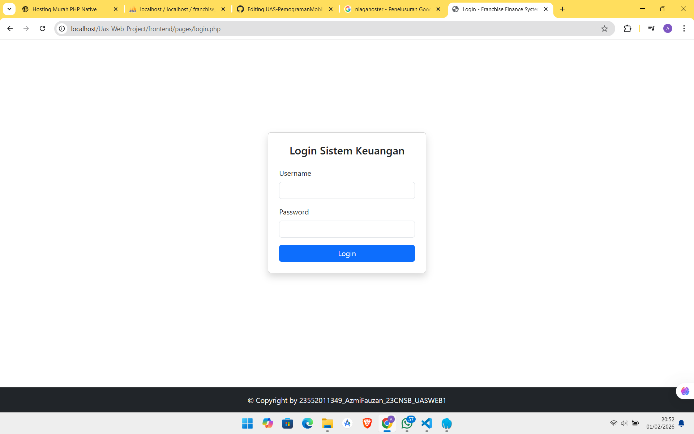
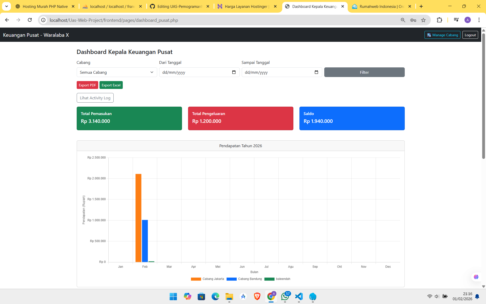
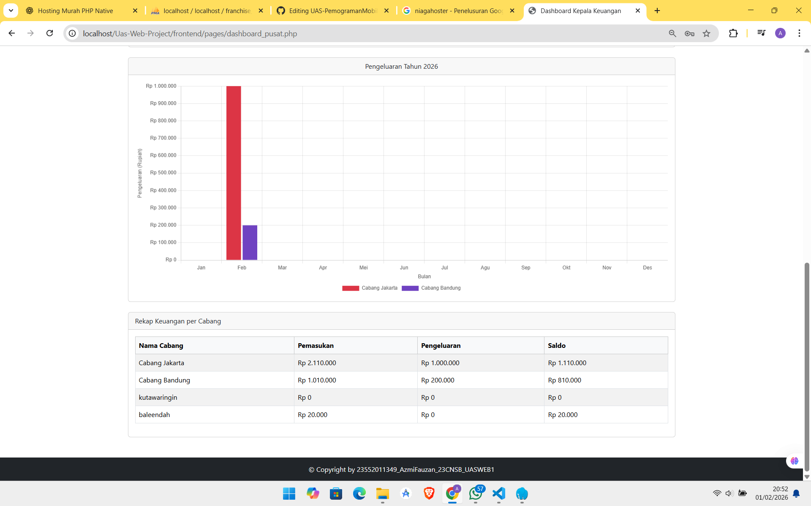
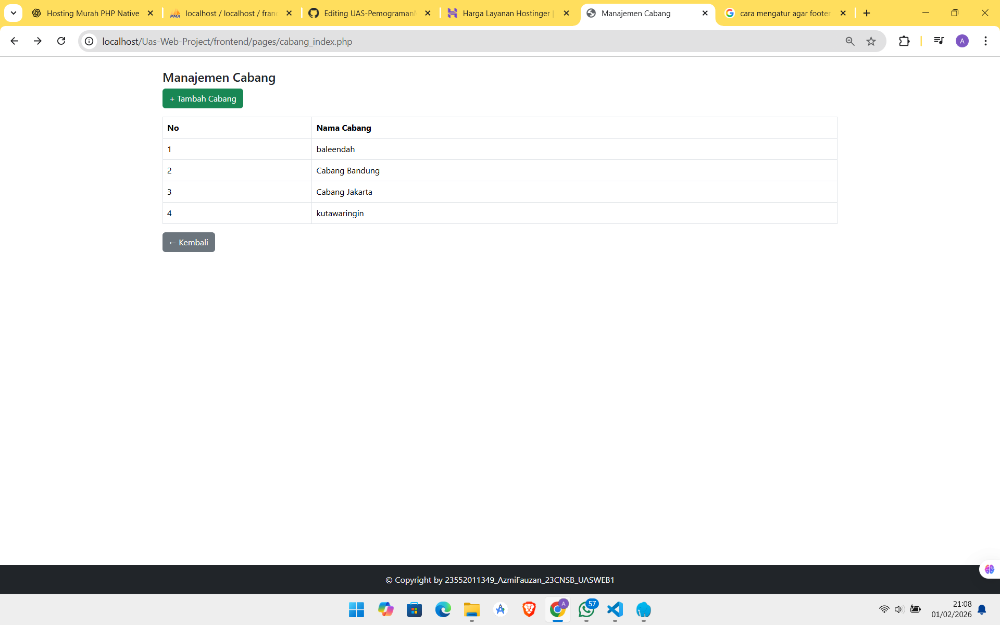
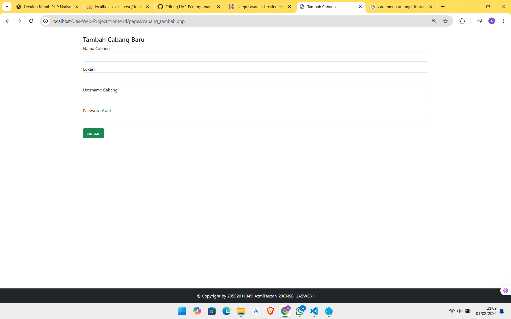
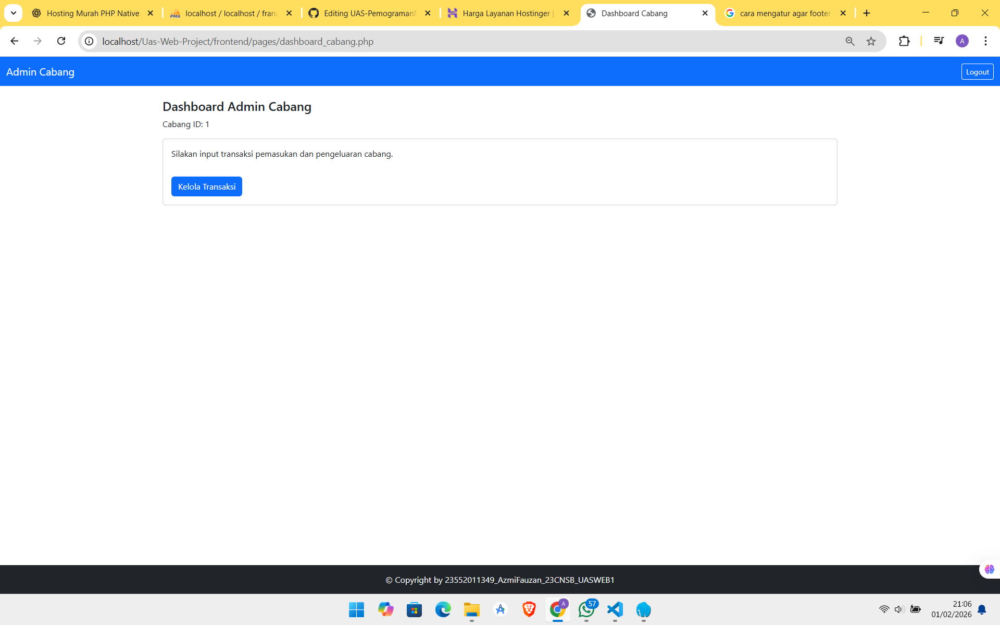
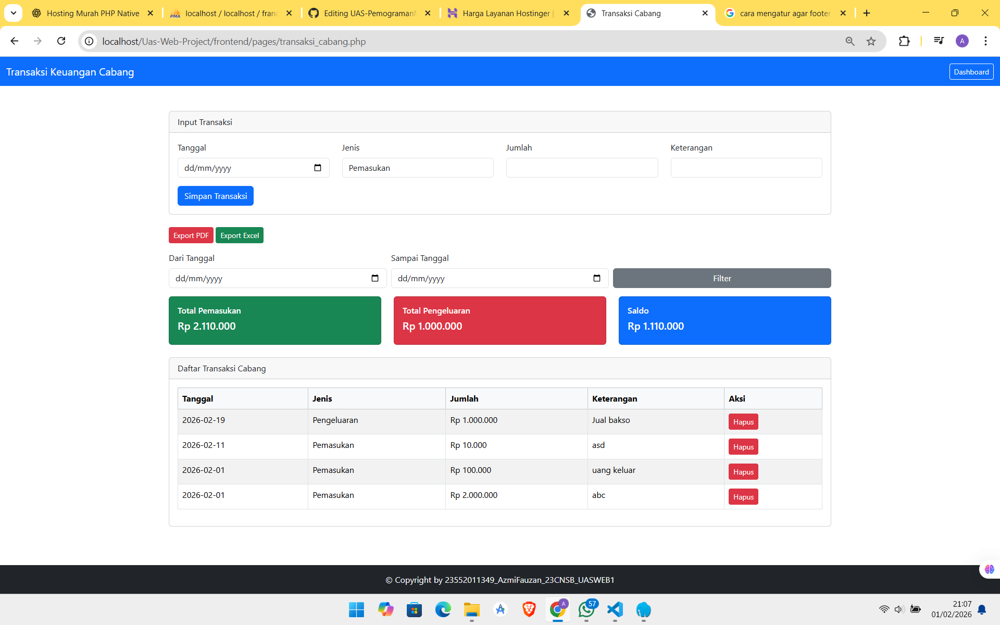

# Franchise Finance System

*Aplikasi Web untuk Pengelolaan Keuangan Waralaba (Franchise)*

---

**Nama** : Azmi Fauzan Alwan  
**NIM** : 23552011349  
**Kelas** : 23CNSB  
**Mata Kuliah** : Pemrograman Web
**Website** : https://finance-managament.my.id 

---

## 📌 Deskripsi Aplikasi

Franchise Finance System merupakan aplikasi web berbasis **PHP Native**
yang dikembangkan untuk membantu pengelolaan dan pemantauan keuangan
pada sistem waralaba (franchise).

Aplikasi ini memungkinkan pihak pusat (Kepala Keuangan) untuk
memonitor pemasukan dan pengeluaran setiap cabang secara terpusat,
terstruktur, dan real-time.

---

## 🎯 Tujuan Pengembangan

- Menerapkan konsep Pemrograman Web menggunakan PHP Native
- Mengimplementasikan sistem login berbasis role
- Mengelola data keuangan cabang secara terpusat
- Menyajikan data keuangan dalam bentuk tabel dan grafik

---

## 🗂️ Struktur Folder Aplikasi

<pre>
Uas-Web-Project/
├── backend/
│   ├── auth/        # login, logout, session
│   ├── cabang/      # logic tambah cabang
│   ├── config/      # koneksi database
│   ├── report/      # export PDF & Excel
│   └── transaksi/   # summary & rekap data
│
├── frontend/
│   ├── pages/       # halaman utama aplikasi
│   └── partials/    # header / footer
│
├── database.sql
│── README.md
└── index.php
</pre>

---

## 🧩 Fitur Aplikasi

- Login sistem (Admin Pusat & Cabang)
- Manajemen cabang (tambah cabang + akun otomatis)
- Dashboard keuangan pusat
- Rekap pemasukan dan pengeluaran
- Grafik keuangan per cabang dan per bulan
- Filter data berdasarkan tanggal dan cabang
- Export laporan ke PDF dan Excel
- Footer pada setiap halaman sesuai ketentuan soal

---

## 👥 Role Pengguna

### 1. Admin / Kepala Keuangan Pusat
- Mengelola data cabang
- Melihat seluruh data keuangan cabang
- Melihat grafik pemasukan dan pengeluaran
- Mengunduh laporan keuangan

### 2. User Cabang
- Login menggunakan akun cabang
- Mengelola transaksi cabang masing-masing
- Data transaksi otomatis terintegrasi ke pusat

---

## 📊 Sistem Grafik

Grafik keuangan menggunakan **Chart.js** dengan ketentuan:
- Sumbu X : Bulan
- Sumbu Y : Nominal pemasukan / pengeluaran
- Setiap warna mewakili satu cabang
- Dataset otomatis bertambah ketika cabang baru ditambahkan

---

## ⚙️ Teknologi yang Digunakan

- PHP Native
- MySQL / MariaDB
- Bootstrap 5
- Chart.js

---

<h2>🧩 Halaman Aplikasi</h2>

 

<h2>📸 Screenshot Aplikasi</h2>

Screenshot setiap halaman aplikasi diletakkan pada folder
<code>screenshots/</code> dan ditampilkan sebagai berikut:

<ul>
    <li><strong>Login</strong></li>
  

  
  

    

  <li><strong>Dashboard Admin Pusat</strong></li>
  

  

  

    

  <li><strong>Manage Akun Cabang</strong></li>
  

  

  

  

    

  <li><strong>Dahboard Admin Cabang</strong></li>
  

  
  

    

  <li><strong>Kelola Keuangan Cabang</strong></li>
  

  
  

    

  

</ul>

## 🚧 Status Pengembangan

Aplikasi telah berada pada tahap **fungsional** dan dapat digunakan
sesuai kebutuhan tugas Ujian Akhir Semester (UAS).
Pengembangan lanjutan dapat dilakukan untuk peningkatan keamanan,
tampilan, dan fitur tambahan.

## 🗄️ Database

Repository ini tidak menyertakan database asli.
Sebagai gantinya, disediakan file `database_sample.sql`
yang berisi struktur tabel dan data contoh.

### Akun Sample
- Username: sample_pusat
- Password: password

---

